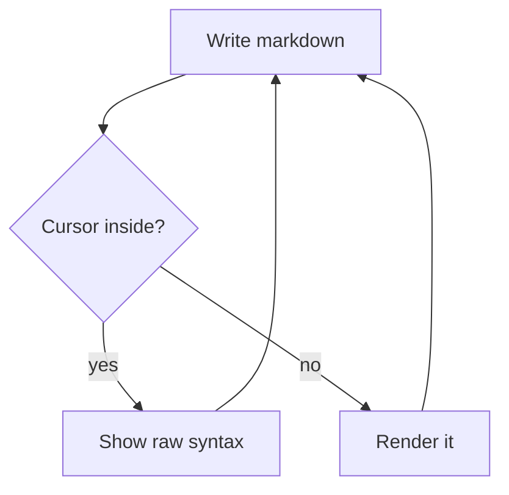

# Extended Syntax

Everything on this page arrived in Phase 4.

## Math

Inline math sits in a sentence: the identity $e^{i\pi} + 1 = 0$ renders in place, and so does $\frac{a}{b} \cdot \sqrt{2}$.

Block math gets centered display treatment:

$$
\int_0^\infty e^{-x^2}\,dx = \frac{\sqrt{\pi}}{2}
$$

Dollar signs in prose stay prose: this costs $5 and that costs $10.

## Footnotes

Footnote references render superscript[^first] and you can use several[^second] in one paragraph.

[^first]: The definition lines stay readable down here.
[^second]: Jump-to-definition can come in a later polish pass.

## Diagrams

Click the diagram to edit its source; click away to re-render.

## Frontmatter

Scroll to the top — the YAML block between `---` fences is styled as quiet metadata, and it only counts as frontmatter on line one of the file.
